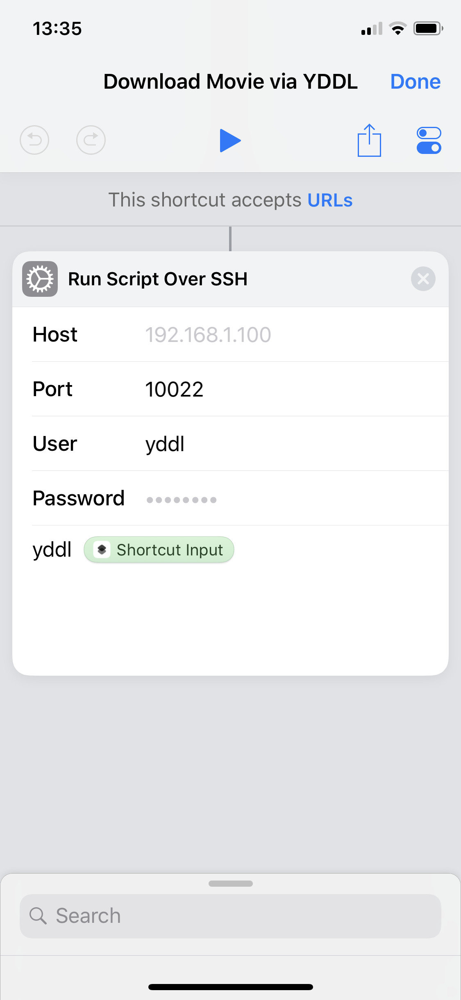
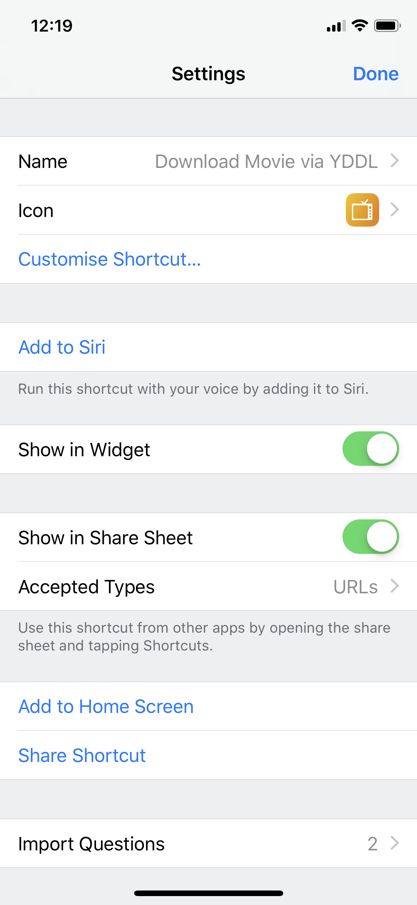

# YDDL

## Intro

Did you ever run into the situation that you were on the run and didn't have time to watch this special video and want to save it for later when you're at home?

For downloading videos and sometimes sound there is the famous youtube-dl script (which also -despite the name- covers a lot of other sites, like the german national television mediathek). But it's not made for beeing invoked at your iPhone.

## How to Use


## Setup

1. Install docker on your host.
1. Build and start the yddl docker image (see d-build.sh and d-run.sh for reference)
1. Expose the chosen Port (all scripts use 10022 as an example) over your router to the docker instance.
1. Setup a iOS Shortcut

### Docker

For basic security please make sure that your docker image does not run under root!

Create a system user that caonnot login on the docker host:

    sudo adduser --system --no-create-home --disabled-login --group yddl

Make sure the user has write acces to your ```data``` path.

And run the docker container with setuid.

### iOS Shortcut

1. Download [Apple Shortcuts](https://apps.apple.com/us/app/shortcuts/id915249334) on your device.
1. Open the App and hit "Create Shortcut" and give it a name
1. Add "Run Script over SSH" and fill out the Host, Port, User and Password variables 
1. At Script add ```yddl <Shortcut Input Variable>``` (See image below)
1. Goto the settings and check "Show in Share Sheet" and set "Accepted Types" to "URLs"




## Hints

Please use only where legally allowed (this differs from country to country and webpage to webpage).
